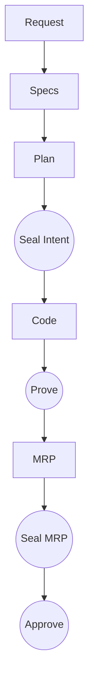

# Getting Started with GEAS-AI

Welcome to **GEAS-AI (Governance Enforcement for Agentic Systems)**, the governance layer for **Software Engineering 3.0**. GEAS ensures that AI agents operate within a controlled, "Spec-First" environment, where every action is anchored in a cryptographically sealed blueprint.

## 🛠 Prerequisites

- **Python**: 3.10 or higher.
- **uv**: We recommend using [uv](https://github.com/astral-sh/uv) for fast and reliable package management.

## 🚀 Installation

Install GEAS-AI using `uv`:

```bash
uv pip install geas-ai
```

Alternatively, you can run it directly without a permanent installation:

```bash
uv run geas --help
```

## 🏗 Initializing Your Project

To bootstrap GEAS in your repository, run:

```bash
geas init
```

This creates a `.geas/` directory containing:

- `config/identities.yaml`: Registry of authorized Ed25519 public keys.
- `config/agents.yaml`: Defines your AI team personas (Architect, Developer, QA, etc.).
- `config/models.yaml`: Configures your LLM providers.
- `bolts/`: The directory where all units of work (Bolts) will reside.
- `active_context.md`: A pointer file indicating the current active Bolt.

## 🔑 Identity Setup

Before you can seal any critical documents (like the Intent or MRP), you need a cryptographic identity. GEAS uses Ed25519 keys to sign your actions.

1. **Create your identity**:
   ```bash
   uv run geas identity add --name my-username --role human
   ```
   This generates a keypair. The private key is stored securely in `~/.geas/keys/` (0600 permissions), and the public key is added to the project's registry.

2. **Verify it exists**:
   ```bash
   uv run geas identity list
   ```

## ⚡️ The GEAS Workflow

GEAS enforces a rigorous lifecycle for every feature or bug fix, organized as a **Bolt**.



### 1. Create a New Bolt

Start a new unit of work:

```bash
geas new feature-name
```

This creates a folder in `.geas/bolts/feature-name/`, initializes the `lock.json` ledger, and sets it as the active context.

### 2. The Blueprinting Process

Every Bolt follows a standard sequence:

1. **Request (`01_request.md`)**: Define the user's intent or feature request.
2. **Specs (`02_specs.md`)**: The **Spec Writer** agent translates the request into technical requirements.
3. **Plan (`03_plan.md`)**: The **Architect** agent designs the implementation plan.

### 3. Sealing the Intent

Before any code is written, the artifacts must be "sealed". You can seal them individually or as a complete Intent package.

**The Intent Seal** requires a Human signature and locks all three documents (`req`, `specs`, `plan`):

```bash
geas seal intent --identity my-username
```

This creates a `SEAL_INTENT` event in the `lock.json` ledger, cryptographically linking your identity to the approved plan.

### 4. Implementation and Verification

1. **Code**: The **Developer** executes the approved plan.
2. **Prove**: Generate the **Evidence**:

   ```bash
   geas prove
   ```

   This runs your tests and creates the `mrp/manifest.json` (Code Snapshot) and `mrp/tests.log`.

3. **MRP (`mrp/summary.md`)**: The **QA Engineer** reviews the evidence and writes the summary.
4. **Seal MRP**: The QA Engineer (or Agent) seals the evidence:

   ```bash
   geas seal mrp
   ```

### 5. Approval

Finally, a Human identity (usually a Tech Lead or Maintainer) reviews the sealed package and provides final approval for the merge.

```bash
geas approve --identity my-username --comment "Verified and ready to merge."
```

## 🛡 Verification and Status

At any point, you can check the status of your current Bolt:

```bash
geas status
```

Or verify the cryptographic integrity of all sealed artifacts and the hash chain:

```bash
geas verify
```
